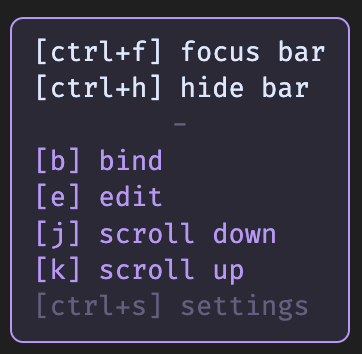
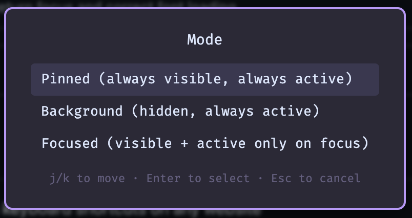
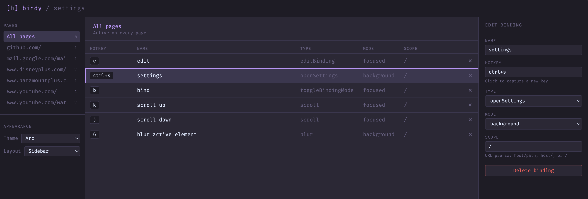

# Bindy

A chrome extension to allow users to define custom keyboard shortcuts on any website

## How it works

Bindy captures the dom path of a user selected element then when you press the hotkey it emulates a user click. For iframes it uses a child worker to pass selectors and click events so they can get captured in any context. All of bindy's functionality is achieved via vanilla js and chrome functions and there is no network traffic or external dependencies.

## Features

- bind any clickable element to a hotkey
- emulate an existing hotkey with another one
- set a hotkey for common browser actions (scroll, theme, layout)
- site-specific hotkeys scoped to the current page path
- auto click an element when it appears (i.e. a skip ad button)

## Installation

1. clone this repo or download it via `Code` -> `Download Zip` (unzip it if you download it)
2. go to `chrome://extensions` and enable Developer mode in the top right corner
3. click `load unpacked` and select the bindy folder
4. press `ctrl + f` to focus bindy and start binding new shortcuts!

## Default Keyboard Shortcuts

| Shortcut | Action                 |
| -------- | ---------------------- |
| `ctrl+f` | Focus the Bindy bar    |
| `ctrl+b` | Toggle bind mode       |
| `ctrl+e` | Edit existing bindings |
| `ctrl+h` | Show / hide the bar    |
| `ctrl+s` | Open settings          |

All default shortcuts can be rebound (including the edit keybind) from the edit screen (`ctrl + e`).

## Binding Modes

- **Pinned** keeps shortcuts visible in the bar and active regardless of focus state
- **Background** hides a shortcut from the bar but keeps it active. When the bar is focused it expands to show all background shortcuts
- **Focused** hides a shortcut from the bar and only lets it activate when the bar is focused. This is most useful for uncommon shortcuts or global shortcuts that you don't always need

## Scopes

- This page: the exact current url (i.e. https://www.youtube.com/watch)
- This site: the current url path (i.e https://www.youtube.com)
- All pages: every website
- Custom path: a simple pattern for a subset of paths (i.e. /watch)

## Settings Page

Bindy has a built in action `ctrl + s` to open a full settings page to edit/delete keybinds for all sites. This can be useful for removing or editing keybinds without actually visiting a site or to fix the page scope for complex urls.

## Known Issues

- Emulation doesn't always work as we can only send synthetic keyboard events and some sites will ignore them. (Youtube). An easy work around is to use click element instead
- Some iframes don't work properly
- If a site changes a dom component it might break a shortcut (you can always edit it)

## Roadmap

- [x] auto (toggle on /off)
- [ ] toggle default behavior (pass through)
- [x] web interface for settings
- [ ] add creation flow to settings
